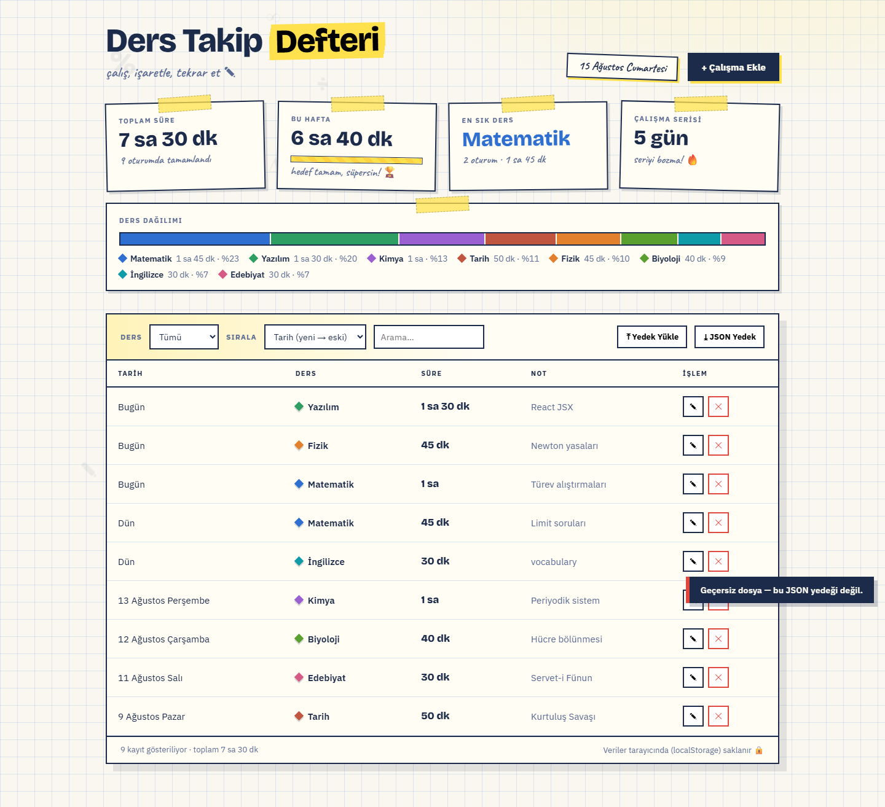

# Ders Takip Defteri

Öğrencilerin ders çalışma oturumlarını kaydedip takip edebildiği, saf (vanilla) JavaScript ile yazılmış bir web uygulaması. Veriler tarayıcının yerel deposunda (localStorage) saklanır; kurulum veya sunucu gerektirmez, `index.html` dosyasına çift tıklayıp doğrudan çalışır.



## Canlı Demo

**https://mustafa-ali-ertugrul.github.io/ders-takip-defteri/**

## Özellikler

- **Çalışma ekleme** (ders, süre, tarih, not) — hızlı süre çipleri (+25/+45/+60 dk)
- **Güncelleme ve silme** — silmede onay sorulmaz; kayıt anında silinir ve **7 saniyelik "Geri Al"** bildirimiyle kurtarılabilir
- **Filtreleme ve arama** — derse göre filtre, nota/ders adına göre arama (Türkçe büyük/küçük harf duyarlı: `İNGİLİZCE` ↔ `ingilizce`)
- **Sıralama** — tarihe, süreye veya ders adına göre
- **İstatistik kartları** — toplam süre, bu haftaki süre (haftalık hedef çubuğu), en sık çalışılan ders, günlük çalışma serisi (streak)
- **Ders dağılım grafiği** — derslere göre renkli yüzdeler
- **Ayarlar** — özel dersler ekleme/silme (8 renkli paletten otomatik renklendirme) ve haftalık hedefi değiştirme (30–3000 dk)
- **JSON yedekleme** — tüm kayıtları tek tıkla yedek dosyası olarak indirme
- **Yedekten geri yükleme** — uygulama içi onay modalı ile **Değiştir** (üzerine yazar) veya **Birleştir** (aynı kimlikli kayıtları atlayarak ekler); yedekteki bilinmeyen ders adları otomatik olarak ders listesine eklenir (her iki durumda da geçerli kayıtlar alan bazlı doğrulanır)
- **Erişilebilirlik** — tüm modallarda `role="dialog"`, `aria-modal`, odak tuzağı (Tab/Shift+Tab), Escape ile kapatma ve odağı açan öğeye geri verme; bildirimler `role="alert"` taşır
- **Form doğrulama** — süre aralığı (1–1440 dk), zorunlu alanlar, gelecek tarih engeli
- Tamamı Türkçe arayüz, responsive tasarım; hiçbir yerde `alert()`/`confirm()`/`prompt()` kullanılmaz

## Kullanılan Teknolojiler

| Teknoloji | Amaç |
|---|---|
| HTML5 | Sayfa yapısı |
| CSS (pure) | Stil ve responsive tasarım |
| JavaScript (vanilla) | Uygulama mantığı, CRUD işlemleri, DOM manipülasyonu |
| localStorage | Veri saklama |
| Node.js (yalnızca testler) | `test/` klasöründeki birim testleri (`node --test`) |
| Playwright (yalnızca testler) | `tests/` klasöründeki otomatik uçtan uca testler |

## Proje Yapısı

```
index.html          Sayfa yapısı + modallar (ders, yedek onayı, ayarlar)
css/style.css       Tüm stiller
js/core.js          Sabitler + saf (test edilebilir) iş mantığı
js/storage.js       localStorage okuma/yazma, ders listesi & hedef tohumlama
js/ui.js            Çizim (tablo, istatistikler, çipler, ayarlar) + toast/modal yardımcıları
js/app.js           Etkileşim katmanı (CRUD, import, ayarlar, olay bağlantıları)
test/core.test.js   Saf çekirdek için Node birim testleri
tests/app_test.py   Playwright uçtan uca testleri
```

Script sırası kasıtlıdır: `core.js → storage.js → ui.js → app.js` (ES modül yok; `file://` uyumluluğu korunur).

### localStorage Anahtarları

| Anahtar | İçerik |
|---|---|
| `dersTakipStudies` | Çalışma kayıtları `[{id, ders, sure, tarih, not, createdAt}]` |
| `dersTakipSubjects` | Ders listesi `[{ad, renk}]` |
| `dersTakipGoal` | Haftalık hedef (dakika, varsayılan 300) |

## Projede Yapılan CRUD İşlemleri

| İşlem | Nerede |
|---|---|
| **Create** | "+ Çalışma Ekle" → form doldurulup "Kaydet" |
| **Read** | Tablo listesi, istatistik kartları, ders dağılımı |
| **Update** | Tablodaki ✎ butonu → kaydı düzenle; Ayarlar ⚙ → ders listesi ve haftalık hedef |
| **Delete** | Tablodaki ✕ butonu → anında silme + 7 sn "Geri Al" |

## Yerel Çalıştırma

Repo'yu indirin ve `index.html` dosyasını tarayıcıda açın. Başka bir kurulum gerekmez.

## Testler

**Birim testleri** — saf iş mantığı (sıralama, filtreleme, kayıt temizleme, tarih doğrulama, ders listesi/hedef yardımcıları); proje kökünden:

```bash
node --test                 # 48 birim testi
```

**Uçtan uca testler** — CRUD, validasyonlar, geri alma, yedek alma/geri yükleme (Değiştir/Birleştir), modal erişilebilirlik, ayarlar ve mobil görünüm:

```bash
pip install playwright                      # bir kez
python -m playwright install chromium       # bir kez, tarayıcıyı indirir
python tests/app_test.py                    # 54 uçtan uca test
```

## Not

Uygulama verileri yalnızca kullandığınız tarayıcıda saklar; farklı cihaz veya tarayıcılarda veriler **paylaşılmaz**. Kayıtlarınızı "⤓ JSON Yedek" butonuyla dışa aktarabilir, "⤒ Yedek Yükle" butonuyla geri yükleyebilirsiniz.
